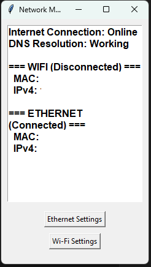
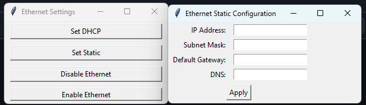

# Network Info GUI Desktop Widget

---



---
A Python desktop application that displays real-time network information. It provides details on the system's internet connection status, DNS resolution, and adapter information (Wi-Fi/Ethernet). It also includes options to configure network adapters via DHCP or static IP.

I created this because I was tired of going through multiple windows just to disable/enable or change IP settings on my adapters while testing. This tool is a slight reinvention of the wheel, but I've found it far more convenient to run it as a scheduled task or background app. Having my internet and DNS connectivity status visible at a glance is much easier than repeatedly using `ping` or `nslookup`.

---

## Features

* Displays current WAN and DNS resolution status.
* Shows network adapter information (IPv4 address, MAC address, and connection status).
* Allows configuring network interfaces to use DHCP or a static IP.
* Real-time updates every 5 seconds.

---

## Platform Compatibility

This tool is designed **for Windows only**.

It uses the Windows-native `netsh` utility to apply network configuration changes, such as:

* Switching between DHCP and static IP addressing.
* Setting DNS servers.
* Managing adapter settings by interface name (e.g., "Wi-Fi", "Ethernet").

Example `netsh` commands used in the background:

```cmd
netsh interface ip set address name="Wi-Fi" source=dhcp
netsh interface ip set address name="Ethernet" static 192.168.0.10 255.255.255.0 192.168.0.1
netsh interface ip set dns name="Wi-Fi" static 8.8.8.8 primary
```

---

## Requirements

* Windows OS
* Run as admin for the netsh commands to work
* Python 3.x
* Python libraries:

  * `psutil`
  * `tkinter` (usually included with Python)

---

## Installation

1. Clone the repository:

   ```bash
   git clone https://github.com/yourusername/repository-name.git
   ```

2. Install required dependencies:

   ```bash
   pip install psutil
   ```

3. Ensure Python 3.x is installed and `tkinter` is available.

---

## Usage

1. Run the script:

   ```bash
   python script_name.py
   ```

2. A window will appear showing real-time network information, refreshed every 5 seconds.

3. Buttons at the bottom allow you to access adapter settings:

   * **Set to DHCP** for automatic configuration.
   * **Set Static** to manually configure IP address, subnet mask, gateway, and DNS.
  
## Disclaimer
This tool was created for personal use to make day-to-day network testing and configuration quicker and more convenient. It is not intended for enterprise environments, production systems, or critical infrastructure.

I’m not a professional software developer, just someone who builds tools for my own stuff. The code is provided as-is, with no guarantees or warranties. Feel free to use it, modify it, or improve it, but use at your own risk.
